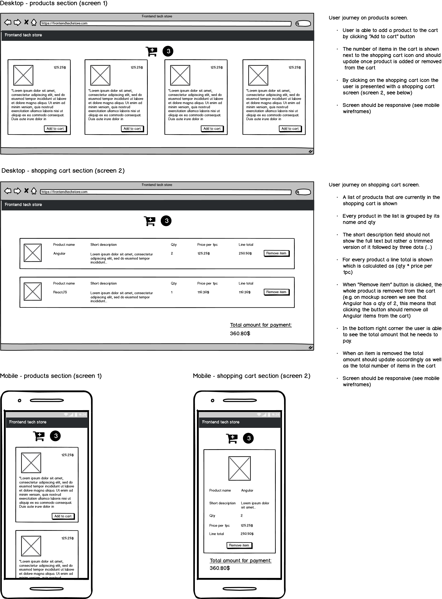

# Pace frontend coding assignment

Welcome to the Pace tech store development team!

Pace tech store allows developers to buy best libraries and frameworks from web ecosystem and we need your support in making our online store even better. We've already gathered all requirements but some parts of our online store are still under construction and this is where you come in!

Read through the requirements and check out the wireframes. The submitted solution should cover all requirements from the below document.

## Getting started - step by step

This project was bootstrapped with [Create React App](https://github.com/facebook/create-react-app).

- Install [NodeJS](https://nodejs.org/en/)
- `cd` into this folder
- Run `npm install`
